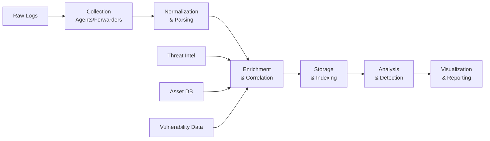

# 🏗️ SIEM Architecture & Design Principles


## 📋 Table of Contents
- [Overview](#-overview)
- [Core Architecture Components](#-core-architecture-components)
- [Data Flow Design](#-data-flow-design)
- [Platform-Specific Architectures](#-platform-specific-architectures)
- [High Availability & Disaster Recovery](#-high-availability--disaster-recovery)
- [Performance Considerations](#-performance-considerations)
- [Security Considerations](#-security-considerations)
- [Cost Optimization](#-cost-optimization)

## 🎯 Overview

This document outlines the architectural principles, design patterns, and best practices for implementing and managing multi-SIEM environments. The architecture supports three major SIEM platforms while maintaining consistency, portability, and operational efficiency.

### Design Philosophy
```yaml
Core Principles:
  - Portable: Detection logic works across all SIEM platforms
  - Scalable: Architecture supports growth from GB to PB/day
  - Resilient: No single point of failure
  - Cost-Aware: Optimized for operational efficiency
  - Secure: SIEM security follows zero-trust principles
```
## 1. Processing Layer Architecture


The architectures below are presented from a **defender and SOC analyst perspective**, focusing on ingestion, processing, detection, and response.

---

## Splunk Architecture

```text
┌─────────────────────────────────────────────────────┐
│                 SPLUNK ARCHITECTURE                 │
├─────────────┬──────────────┬────────────────────────┤
│  Forwarders │  Indexers    │     Search Heads       │
│  (UF / HF)  │  (Clustered) │     (Clustered)        │
├─────────────┼──────────────┼────────────────────────┤
│ • Lightweight│ • Index data │ • Search processing   │
│ • Local buff │ • Replication│ • Dashboards          │
│ • SSL / TLS  │ • Retention  │ • Alerting            │
│ • Load bal.  │ • Compression│ • Knowledge objects   │
└─────────────┴──────────────┴────────────────────────┘
```

### Components

* **Forwarders (UF / HF)**
  Collect and securely forward logs from endpoints and servers.

* **Indexers**
  Parse, index, compress, and store incoming data. Often deployed as a cluster for resilience.

* **Search Heads**
  Handle user searches, dashboards, alerts, and knowledge objects.

### Key Considerations

* **Indexer Clustering**: Minimum of **3 nodes** recommended for high availability.
* **Search Head Clustering**: Required for search continuity and user access during failures.
* **Forwarder Management**: Use a **Deployment Server** to centrally manage forwarders.

---

## Azure Sentinel Architecture

```text
┌─────────────────────────────────────────────────────┐
│              AZURE SENTINEL ARCHITECTURE            │
├──────────────┬──────────────┬───────────────────────┤
│ Data Sources │ Log Analytics│     Sentinel          │
│              │  Workspace   │     Workspace         │
├──────────────┼──────────────┼───────────────────────┤
│ • Azure ARC  │ • Log ingest │ • Analytics rules    │
│ • Syslog     │ • Data ret.  │ • Hunting queries    │
│ • CEF        │ • Indexing   │ • Workbooks          │
│ • REST API   │ • Tables     │ • Playbooks (SOAR)   │
└──────────────┴──────────────┴───────────────────────┘
```

### Components

* **Data Sources**
  Azure services, on‑prem systems, and third‑party products via Syslog, CEF, or APIs.

* **Log Analytics Workspace**
  Central storage and indexing layer for logs.

* **Microsoft Sentinel**
  SIEM + SOAR layer providing detection, investigation, and automation.

### Key Considerations

* **Workspace Design**: Decide between **single** or **multiple workspaces** based on scale and tenancy.
* **Data Retention**: Hot data (≈30 days) vs. archive storage (months to years).
* **Cost Control**: Use daily ingestion caps, data filters, and table-level retention policies.

---

## IBM QRadar Architecture

```text
┌─────────────────────────────────────────────────────┐
│                QRADAR ARCHITECTURE                  │
├──────────────┬──────────────┬───────────────────────┤
│ Event        │ Data Nodes   │     Console           │
│ Collectors   │ (Storage)    │     (Management)      │
├──────────────┼──────────────┼───────────────────────┤
│ • EPS based  │ • Event store│ • Rule management    │
│ • Protocol   │ • Flow store │ • Dashboards         │
│   support    │ • Performance│ • Offense management │
│ • Local proc.│   mgmt.      │ • User interface     │
└──────────────┴──────────────┴───────────────────────┘
```

### Components

* **Event Collectors**
  Receive logs and flows using various protocols and normalize them.

* **Data Nodes**
  Store event and flow data while managing performance and retention.

* **Console**
  Central management interface for rules, dashboards, offenses, and administration.

### Key Considerations

* **EPS Planning**: Licensing and performance depend heavily on events per second.
* **Scalability**: Add collectors and data nodes as ingestion grows.
* **Offense Management**: Correlation rules drive offense creation and prioritization.

---

## 🔐 Security Hardening Checklist

A baseline checklist to reduce risk and harden SIEM infrastructure against misuse or compromise.

### ✅ Hardening Controls

- **Enable audit logging for SIEM administrative actions**  
  Capture configuration changes, privileged actions, and user activity for accountability and investigations.

- **Implement IP allowlisting for administrative access**  
  Restrict SIEM management interfaces (UI, API, SSH) to trusted SOC or internal network ranges only.

- **Regular vulnerability scanning of SIEM components**  
  Scan indexers, search heads, consoles, agents, and supporting systems for known vulnerabilities.

- **Secrets management for API keys and credentials**  
  Store secrets in secure vaults or managed secret services. Avoid hardcoding credentials in configs or scripts.

- **Regular backup and test restoration procedures**  
  Back up configurations, indexes, and detection content, and periodically test restores to ensure recovery readiness.


| Platform | Strength                   | Ideal Use Case                |
| -------- | -------------------------- | ----------------------------- |
| Splunk   | Flexibility & search power | Large, diverse environments   |
| Sentinel | Cloud-native & SOAR        | Azure-centric infrastructures |
| QRadar   | Strong correlation         | Compliance-driven SOCs        |
## 🔗 References & Further Reading

### Official Documentation

- **Splunk Enterprise Architecture**  
  https://docs.splunk.com/Documentation/Splunk/latest/Deploy/Architectureoverview

- **Azure Sentinel Architecture**  
  https://learn.microsoft.com/en-us/azure/sentinel/architecture

- **IBM QRadar Architecture**  
  https://www.ibm.com/docs/en/qsip/7.5?topic=architecture-qradar-deployment

---

### Best Practices Guides

- **SANS SIEM Implementation Guide**  
  https://www.sans.org/white-papers/siem-implementation-guide/

- **MITRE ATT&CK – Detection Engineering**  
  https://attack.mitre.org/resources/

- **NIST SP 800-137: SIEM Guidelines**  
  https://csrc.nist.gov/publications/detail/sp/800-137/final

---

### Tools & Resources

- **SIGMA Detection Rules**  
  https://github.com/SigmaHQ/sigma

- **Atomic Red Team**  
  https://github.com/redcanaryco/atomic-red-team

- **OSSEM (Open Source Security Events Metadata)**  
  https://github.com/OTRF/OSSEM


